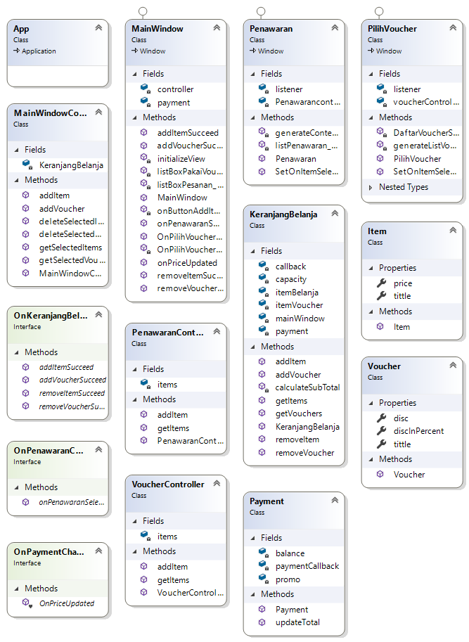

# OrderFood
Aplikasi ini berfungsi untuk memesan suatu item/barang dan menjumlahkan total harga barang yang dipesan oleh si pembeli.

### Fungsi
* User dapat melihat daftar makanan yang ditawarkan
* User dapat memasukkan atau menghapus makanan pilihan ke dalam keranjang
* User dapat melihat subtotal makanan yang terdapat pada keranjang
* User dapat melihat daftar voucher yang ditawarkan
* User dapat menggunakan salah satu voucher
* User dapat melihat harga total termasuk potongannya

### Class Diagram


### How Does It Works?
Saat aplikasi pertama kali dibuka user akan disuguhkan oleh tampilah awal dari aplikasi yang berisi Keranjang, Voucher, Sub Total, dan Total Harga. Yang mana user dapat memilih item yang akan diambil dengan mengklik tombol Tambah Pesanan. 
Serta user juga akan diberikan voucher discon dengan mengklik tombol Pilih Voucher, vouche ini secara otomatis akan mengurangi total harga sebelumnya.

Pada `Penawaran.xaml.cs` terdapat code seperti yang dibawah, code ini berfungsi untuk list daftar menu yang nanti akan ditambahkan di listBox.
```csharp
private void generateContentPenawaran()
        {
            Item coffeLate = new Item("Coffe Late", 30000);
            Item blackTea = new Item("BlackTea", 20000);
            Item pizza = new Item("Pizza", 75000);
            Item milkShake = new Item("Milk Shake", 15000);
            Item friedFrice = new Item("Fried Frice Special", 45000);
            Item watermelonJuice = new Item("Watermelon Juice", 25000);
            Item lemonSquash = new Item("Lemon Squash", 30000);

            Penawarancontroller.addItem(coffeLate);
            Penawarancontroller.addItem(blackTea);
            Penawarancontroller.addItem(pizza);
            Penawarancontroller.addItem(milkShake);
            Penawarancontroller.addItem(friedFrice);
            Penawarancontroller.addItem(watermelonJuice);
            Penawarancontroller.addItem(lemonSquash);

            listPenawaran.Items.Refresh();
        }
```
`MainWindowController.cs` berfungsi sebagai pengontrol Keranjang Belanja agar nanti dapat berfungsi dengan baik. Kemudian `PilihVoucher.xaml.cs` yang mempunyai fungsi mirip seperti Penawaran, hanya saja ini digunakan untuk Voucher yang mana nantinya akan ditampilkan pada listBox.